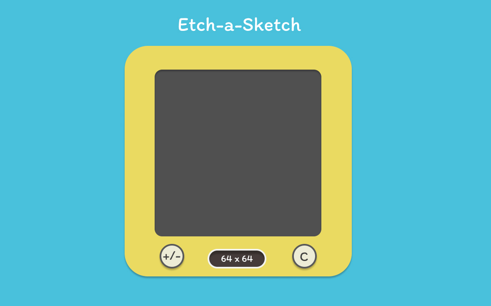

# etch-a-sketch

## Introduction

This is the fourth project in The Odin Project's Foundations course, its purpose is to demonstrate the use of javascript and DOM manipulation, by using different eventlisteners and also the use of javascript for generation of large amounts of web elements via loops to cut down on the need for manually adding them to the htmls file.

## Tech Stack

- HTML
- CSS
- Javascript
- Figma
- Canva
- VS-Code

## Skills Demonstrated

- Created a mockup design for UI for the etch-a-sketch application
- Utilized HTML elements and div containers to effectively structure the page content for streamlined styling and positioning.
- Utilized CSS for styling and positioning content to replicate figma design
- Used javascipt loops for the creation of large amount of web elements 128 x128 grid to avoid manually typing a large html file
- Utilze other event listeners besides 'click' to make a drag and click etch-a-sketch canvas screen

## Mockup Design

